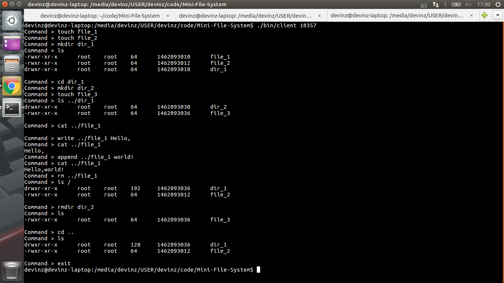
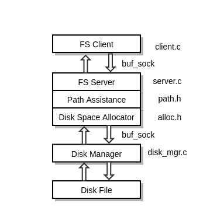
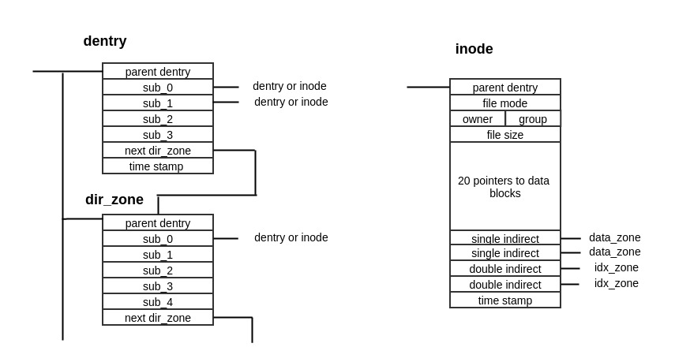

# Mini File System

A Mini File System based on a pseudo disk manager, where the "disk" is simulated by a 20 MB Ext4 file.

## Contents

	.
	├── bin
	├── data
	│   └── DISK_FILE
	├── LICENSE
	├── Makefile
	├── README.md
	└── src
		├── alloc.c
		├── alloc.h
		├── client.c
		├── disk_mgr.c
		├── disk_test.c
		├── format.c
		├── fs_header.h
		├── fs_lib.c
		├── path.c
		├── path.h
		├── server.c
		├── utils.c
		└── utils.h

## Test Script

(1) Run "./bin/disk_mgr 10356" to start the disk manager.

(2) Run "./bin/server 10356 10357" to start the file system server.

(3) Run "./bin/client 10357" to start the file system client.

## Big Picture

## Data Structures

Each disk block (512 bytes) is divided into 8 64-byte zones, and there are five types of zones.

(1) A dentry is a zone storing meta data of a directory, which forms a tree structure.

(2) A dir\_zone is the extension of a dentry, storing pointers to sub-dentries or inodes.

(3) An inode is the core of a file, through which we can get access to its data blocks.

(4) A data\_zone stores 64 bytes of data, namely the content of a file.

(5) An idx\_zone stores 32 pointers that point to other idx\_zones or data\_zones.

The first 4 zones of the first disk block is liable to keep track of the usage of all the disk zones, which constitute a "bitmap". 
The usage of any zone on the remaining part of the disk is indicated by two bits in bitmap, and hence a zone may have four possible states.

## Socket Communications

(1) Query about Disk Info:

	Client >	I
	Server >	Disk Info: ...

(2) Read-from-Disk Request:

	Client >	R c s
	Server >	FOLLOW num
    Client >    EXPECT
	Server >	# data buffer 1
    Client >    EXPECT
	Server > 	# data buffer 2
    Client >    EXPECT
		...		...
	Server >	# data buffer N	(all buffers sum up to num bytes)

(3) Write-to-Disk Request:

	Client >	W c s n
	Server >	EXPECT
	Client >	# data buffer 1
	Server >	EXPECT
	Client > 	# data buffer 2
	Server >	EXPECT
		...		...
	Server >	EXPECT
	Client >	# data buffer N
	Server >	OVER

(4) Exit a Disk Service:

	Client >	E
	Server >	BYE

(5) FS Server Reply Codes:

    0: Task has been done.

    1: Waiting for one buffer of data. After client sends data, server replies with 0 code.

    2: Requesting to send messages, which should be responded with "ACK".
    Then server would send the total number of messages that will be sent,
    and every time client sends an "EXPECT" server would respond with one buffer of data.
    
    3: Service has drawn to a close.

    4: Execution failed.

    -1: Command is invalid.

BTW, I have a similar socket programming project [here](https://github.com/DevinZ1993/Pieces-of-Code/tree/master/projects/ftp), 
which is an FTP client-server system written in Java.

## Some Limits

(0) This FS design is AWFUL!!! Same i-node format should have been used for both regular files and directories in that a directory is only a special file whose data blocks are dentries. (I should have referred to S5FS, but I didn't... Orz)

(1) A free list like the one in S5FS should have been maintained, rather than the bitmap that I'm currently using. Now the disk size is restricted to 20 MB and could hardly be scaled up.

(2) The name of a file or directory could not be longer than 9 characters, and cannot include any whitespaces.

(3) The maxium size of a file is 136447 characters, which may not live up to real-world requirements.

(4) Whitespaces could not be written into a file, in that the interpreter of the server would separate it into tokens.

(5) No index has been provided to accelerate look-ups in a directory.

